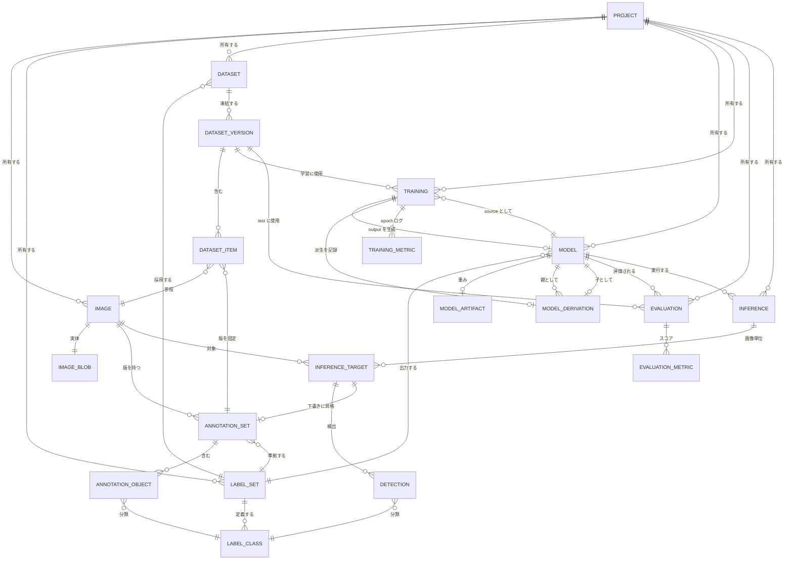

# 概念ERモデル

| 項目 | 内容 |
| --- | --- |
| ステータス | 合意済（設計方針18件が確定、未決なし） |
| 対象 | `order.txt` §12「次の作業」 |
| 最終更新 | 2026-09-05 |
| 関連 | [02-open-decisions.md](./02-open-decisions.md) |

## 1. このドキュメントの位置づけ

`order.txt` で挙げられた管理対象データを、概念レベルのエンティティとリレーションとして定義する。

物理DB設計・ストレージ実装（IndexedDB 等）・MLランタイム（ONNX / WebGPU / WASM 等）・モデル形式の選定は本ドキュメントのスコープ外とする。ここで確定させるのは「何を管理し、何と何がどう関係するか」のみ。

全18論点が決定済みで、エンティティ構成・リレーション・主要属性は確定している。各決定の選択肢と判断理由は [02-open-decisions.md](./02-open-decisions.md) に記録している。

## 2. 合意済みの設計方針

`order.txt` の原案に対し、以下18件の変更を合意した。方針1〜10はエンティティ構成に関わるもの、方針11〜18は属性・運用レベルの決定。

### 方針1. クラス体系を独立エンティティとして管理する（論点01）

クラス名を `Annotation` と `Detection` にそれぞれ文字列で持たせない。`LabelSet` / `LabelClass` を導入し、両者が同じクラス語彙を参照する。

理由:

- 文字列で持つと表記ゆれで同一クラスが分裂し、Dataset のクラス整合性が保証できない。
- モデルの出力次元（0, 1, 2 …）とクラス名の対応を保持する場所がない。
- 転移学習では「元モデルのクラスを引き継ぐ／捨てる／追加する」が必ず発生する。これを表現できる構造が必要。

### 方針2. Dataset を可変コンテナと不変スナップショットに分離する（論点02）

`Dataset`（可変）と `DatasetVersion`（不変）を分ける。`Training` および `Evaluation` が参照するのは `DatasetVersion` のみとする。

理由: `Training` が可変の `Dataset` を直接参照すると、学習後に画像を1枚追加しただけで「どのデータで学習したか」の答えが変わる。`order.txt` §11 の設計思想③「データを捨てない」は、スナップショットなしには成立しない。

### 方針3. Training Result を独立エンティティとしない（論点03）

`Training : TrainingResult` が 1:1 になる分割は冗長。「学習結果」に混在している3つの概念を分解する。

| 元の概念 | 分解後 | 多重度 |
| --- | --- | --- |
| 最終サマリ | `Training` の属性 | 1:1（属性に内包） |
| epoch ごとの推移 | `TrainingMetric` | 1:N |
| 汎化性能 | `Evaluation` | 学習とは別タイミングで何度でも実行しうる |

### 方針4. Evaluation を管理対象に追加する（論点04）

`order.txt` §9 の Application Layer には Evaluation Manager があるが、§6 の管理対象データに対応する項目がなかった。`Evaluation` / `EvaluationMetric` を追加する。

理由: 学習条件の異なるモデル同士は、それぞれの `Training` が持つ val 指標では比較できない。共通のテストセットに対する測定が別途必要。

### 方針5. Annotation を2階層にする（論点05）

`AnnotationSet`（画像1枚 × 1版）と `AnnotationObject`（矩形1個）に分割する。

理由: 単一階層では、アノテーション作業の完了状態・バージョン・由来を記録する場所がない。`Inference` / `Detection` が2階層であることとも対称になる。

### 方針6. モデルのメタと重みを分離する（論点06）

`Model`（メタ・永久保存）と `ModelArtifact`（重み・削除可）を分離し、`Model.artifact_status` で実体の有無を表す。

理由: 系譜を辿れるようにするため全世代のモデルを保持すると、1世代あたり数十MBの重みがブラウザストレージを圧迫する。系譜（追跡性）と重み（実行可能性）は別の寿命を持つべき。

### 方針7. 系譜を ModelDerivation として独立させる（論点07）

親子関係を `Model` の自己参照や `Training` からの導出で表現せず、`ModelDerivation` を独立エンティティとして持つ。`kind` により派生の種別を区別する。

```text
kind : transfer_learning | fine_tune | convert | quantize | import
```

理由:

- 学習を伴わない派生（インポート・形式変換・量子化）を同じ系譜に載せられる。`Training` からの導出だけではこれらを表現できない。
- 将来のモデル統合（複数親）に構造を変えずに対応できる。
- 祖先を辿るクエリが `Training` を経由せずに済む。

`Training` による派生の場合は `ModelDerivation.training_id` に学習処理を紐づけ、系譜と学習履歴の両方から辿れるようにする。

### 方針8. ModelVersion を持たない（論点08）

`Model` を不変ノードとして扱い、系譜そのものをバージョン履歴とする。`ModelVersion` エンティティは作らない。

理由: 転移学習の出力は「同じモデルの新バージョン」ではなく「別のモデル」である。version 番号と lineage を同時に管理すると必ず矛盾する — 例えば Model B から2本派生したとき、両方が v2 になる。

系列名や世代番号の表示が必要になった場合は `ModelFamily` の追加を再検討するが、現時点では導入しない。

### 方針9. 推論を3階層にする（論点11）

`Inference`（実行1回）→ `InferenceTarget`（画像1枚）→ `Detection`（検出1件）の3階層とする。

理由: 複数画像の一括推論に構造を変えずに対応できる。1画像だけの場合も `InferenceTarget` が1件になるだけでコストはほぼない。画像ごとの成否（`status`）と処理時間（`elapsed_ms`）を持つ場所ができる。

### 方針10. Project を導入する（論点16）

`Project` を導入し、一覧のスコープ分割・一括エクスポート・用途ごとのクラス体系分離を可能にする。

`project_id` を持たせる範囲は以下とする。

| 区分 | エンティティ | 理由 |
| --- | --- | --- |
| `project_id` を持つ | `Image`, `LabelSet`, `Dataset`, `Model`, `Training`, `Evaluation`, `Inference` | ユーザーが一覧で直接扱うトップレベル資産 |
| 持たない（親から辿れる） | `AnnotationSet`, `AnnotationObject`, `DatasetVersion`, `DatasetItem`, `TrainingMetric`, `EvaluationMetric`, `InferenceTarget`, `Detection`, `ModelDerivation` | 親エンティティのスコープに従う |
| 持たない（横断共有） | `ImageBlob`, `ModelArtifact` | `content_hash` / `checksum` による重複排除の対象であり、プロジェクトをまたいで共有されうる |

### 方針11. プロジェクト間の参照を許さない（論点18）

`Project` は完全分離とし、あるプロジェクトの `Image` / `Dataset` / `Model` を別のプロジェクトから参照できない。例外は開発者提供 Base Model のみで、`project_id = null` のグローバル資産として全プロジェクトから参照できる。

理由: 系譜がプロジェクト境界をまたぐと「どこまでエクスポートすれば系譜が完結するか」を定義できなくなる。方針17のエクスポート単位はこの分離を前提にしている。

`Model.project_id` は Base Model のために nullable とするが、`origin = builtin` 以外で null を許さない。

### 方針12. 推論結果の由来を記録できるようにする（論点09）

自動ラベリング機能そのものは初期スコープに含めないが、`AnnotationSet.source`（`manual` / `imported` / `from_detection`）と `AnnotationSet.origin_target_id` は最初から持たせる。

理由: 後から属性を追加しても、それ以前に作られたデータの由来は永久に不明のままになる。属性を先に確保しておけば、機能を後から足しても過去データとの整合が取れる。

### 方針13. 失敗・中断した Training も記録として残す（論点13）

`Training.status`（`running` / `completed` / `failed` / `cancelled`）を持ち、`output_model_id` は nullable とする。中断からの再開はサポートせず、やり直しとする（`TrainingCheckpoint` は導入しない）。

理由: ブラウザ上の学習はタブを閉じるだけで中断する。失敗した学習条件が見えることに価値があり、`order.txt` §11 の設計思想③とも整合する。

### 方針14. 推論履歴は pinned + 上限件数で管理する（論点10）

`Inference.pinned` を持ち、pinned されたものは永続、それ以外は上限件数を超えた分から古い順に自動削除する。

理由: 全件永久保存は1回の実行で数十件の `Detection` を生み、ブラウザストレージの上限に早期に到達する。ER への影響は属性1つで済む。

### 方針15. 前処理仕様とスレッショルドを分離する（論点12）

モデル固有の前処理仕様（入力サイズ・正規化・letterbox）は `Model.input_spec`、実行ごとに変えるパラメータ（信頼度しきい値・NMS の IoU・最大検出数）は `Inference` の属性とする。

理由: 前者を変えると結果が壊れ、後者は実行ごとに変えて当然のもの。混在させると「なぜこの結果になったか」を再現できない。

### 方針16. 削除は論理削除を基本とする（論点15）

`Image` / `Model` のメタは `deleted_at` による論理削除とし、物理削除は実体（`ImageBlob` / `ModelArtifact`）のみ許す。これにより `ImageBlob` の分離が確定した。

理由: 容量は実体の削除で解放でき、系譜と履歴は保たれる。「画像を消したがアノテーションと `Detection` は残っている」状態をUIでどう見せるかは実装フェーズで詰める。

### 方針17. ID は UUID / ULID、エクスポート単位は Project（論点17）

全エンティティで UUID / ULID を採番する。エクスポートは `Project` 一式を主単位とし、補助的にモデル単体の書き出しも可能とする。

理由: 将来サーバーへ拡張する際にID再割当てが不要になる。方針11により系譜は `Project` 内で閉じるため、`Project` 一式のエクスポートで系譜が完結する。

### 方針18. Base Model はメタを全件登録し、重みは遅延取得する（論点14）

Base Model は不変IDで配布し、更新版は「別のモデル」として追加する。既存の親子関係は書き換えない。メタ情報（名前・クラス体系・入力仕様）は初回起動時に全件登録し、重みは実際に使用する時点でダウンロードする。

理由: モデル一覧を初回から表示でき、かつ初回起動時の通信量とストレージ消費を抑えられる。

## 3. エンティティ一覧

### A. 画像・アノテーション資産

| エンティティ | ステータス | 役割 | ライフサイクル |
| --- | --- | --- | --- |
| `Image` | 合意済 | 画像1枚の同一性とメタ情報 | 不変（メタは可変） |
| `ImageBlob` | 合意済 | ピクセルデータの実体 | 不変 |
| `AnnotationSet` | 合意済 | 1画像に対する1版のアノテーション | 不変（版を積む） |
| `AnnotationObject` | 合意済 | 矩形1個 | 不変 |
| `LabelSet` | 合意済 | クラス体系 | 不変 |
| `LabelClass` | 合意済 | クラス定義 | 不変 |
| `Dataset` | 合意済 | 論理コンテナ（編集し続ける作業領域） | 可変 |
| `DatasetVersion` | 合意済 | 学習に投入した時点のスナップショット | 不変 |
| `DatasetItem` | 合意済 | 版 × 画像 × アノテーション版 × split | 不変 |

`ImageBlob` の分離は方針16（削除の扱い）で確定した。`ModelArtifact` と同様に、メタを残したまま実体のみ物理削除できる。

### B. モデルと学習

| エンティティ | ステータス | 役割 | ライフサイクル |
| --- | --- | --- | --- |
| `Model` | 合意済 | 系譜上の1ノード。メタのみ、永久保存 | 不変 |
| `ModelArtifact` | 合意済 | 重み本体。破棄しても系譜は残る | 不変・削除可 |
| `ModelDerivation` | 合意済 | 派生関係。学習以外の派生も表現 | 不変 |
| `Training` | 合意済 | 学習処理1回。学習条件を内包 | 進行中は可変 → 完了後は不変 |
| `TrainingMetric` | 合意済 | epoch 単位の学習曲線 | 不変・追記 |

### C. 実行と結果

| エンティティ | ステータス | 役割 | ライフサイクル |
| --- | --- | --- | --- |
| `Evaluation` | 合意済 | モデル × テストセットの性能測定 | 不変 |
| `EvaluationMetric` | 合意済 | 全体 / クラス別のスコア | 不変 |
| `Inference` | 合意済 | 推論実行1回 | 不変 |
| `InferenceTarget` | 合意済 | 実行 × 画像1枚 | 不変 |
| `Detection` | 合意済 | 検出1件 | 不変 |

### 横断

| エンティティ | ステータス | 役割 | ライフサイクル |
| --- | --- | --- | --- |
| `Project` | 合意済 | スコープ分割・一括エクスポート単位 | 可変 |

### 採用しないもの

| 名称 | 判断 | 理由 |
| --- | --- | --- |
| `TrainingResult` | 不採用（合意済） | 方針3のとおり3つに分解した |
| `ModelVersion` | 不採用（合意済） | 系譜との二重管理になる。方針8を参照 |
| `ModelFamily` | 現時点では不採用 | 方針8の付随判断。系列表示が必要になった時点で再検討する |
| `TrainingCheckpoint` | 不採用（合意済） | 方針13。中断した学習の再開はサポートせず、やり直しとする |
| `User` | 不採用 | ブラウザ完結のため。開発者提供／ユーザー作成の区別は `Model.origin` で表す |

## 4. エンティティ定義

属性は概念レベルの例示であり、型・制約・命名規則は物理設計フェーズで確定する。

### A. 画像・アノテーション資産

#### Image

複数の Dataset・推論から共有参照される。1枚の画像を複数の Dataset で利用できることを保証する起点。

```text
image_id
project_id
blob_id
width / height
content_hash
source           : upload | capture | import
imported_at
deleted_at       : 論理削除（方針16）
```

#### ImageBlob

`content_hash` 一致で重複排除し、同じ画像の二重保存を防ぐ。

```text
blob_id
content_hash
mime_type
byte_size
data
```

#### AnnotationSet

「ある画像に対する、ある時点の、完成した1版のアノテーション」。編集のたびに新しい版を作り、過去の学習が参照した内容を保存する。

```text
annotation_set_id
image_id
label_set_id
revision_no
status           : draft | confirmed
source           : manual | imported | from_detection   ← 方針12
origin_target_id : 推論結果由来の場合の InferenceTarget  ← 方針12
created_at
```

#### AnnotationObject

```text
object_id
annotation_set_id
label_class_id     ← 文字列ではなく参照
bbox               : x, y, w, h
bbox_format
attributes
```

#### LabelSet

`Dataset` と `Model` が「同じクラス集合の話をしている」ことを保証する唯一の仕組み。

```text
label_set_id
project_id
name
class_count
derived_from_label_set_id
```

#### LabelClass

`index` がモデル出力の次元との対応を固定する。

```text
label_class_id
label_set_id
name
index
color
```

#### Dataset

ユーザーが編集し続ける論理的な作業領域。画像の出し入れが起きる前提で、可変であることを許容する。

```text
dataset_id
project_id
name
label_set_id
description
created_at / updated_at
```

#### DatasetVersion

学習を開始した時点で切り出す不変スナップショット。`Training` が参照するのは `Dataset` ではなく必ずこちら。

```text
dataset_version_id
dataset_id
version_no
item_count
split_policy
frozen_at
```

#### DatasetItem

版・画像・アノテーション版・split の4点を結びつける。「この学習は画像 X の rev3 のアノテーションを train として使った」を確定させる。

```text
item_id
dataset_version_id
image_id
annotation_set_id     ← 使用したアノテーションの版を固定
split                 : train | val | test
```

### B. モデルと学習

#### Model

系譜上の1ノード。一度作られたら中身は変わらない（不変）ため、更新ではなく派生でしか増えない。メタは軽量なので永久保存する。

```text
model_id
project_id           : nullable。null は Base Model のみ（方針11）
name
origin               : builtin | user_trained | imported
task_type
label_set_id
input_spec           : size, normalize, letterbox    ← 方針15
artifact_id
artifact_status      : present | evicted
created_by_training_id
created_at
```

#### ModelArtifact

```text
artifact_id
format
byte_size
checksum
data
stored_at
```

#### ModelDerivation

モデルの親子関係。`kind` により派生の種別を区別し、学習を伴わない派生も同じ系譜に載せる。

```text
derivation_id
parent_model_id
child_model_id
kind                : transfer_learning | fine_tune | convert | quantize | import
training_id         : nullable（学習由来の場合のみ）
created_at
```

通常は子から見た親が1件だが、将来のモデル統合に備えて多重度は N — N とする（[§5](#5-リレーション)）。

#### Training

学習処理1回。source model・dataset version・学習条件・実行状態を保持する。

```text
training_id
project_id
source_model_id
dataset_version_id
output_model_id       : nullable（方針13）
label_mapping         : source model のクラス → dataset のクラス
hyperparameters       : epochs, lr, batch_size, frozen_layers …
augmentation
status                : running | completed | failed | cancelled   ← 方針13
started_at / ended_at
final_metrics
error_message
runtime_info
```

#### TrainingMetric

学習曲線を後から再描画するために 1:N で持つ。

```text
metric_id
training_id
epoch
metric_name
value
logged_at
```

### C. 実行と結果

#### Evaluation

```text
evaluation_id
project_id
model_id
dataset_version_id
split_used
conf_threshold / iou_threshold
executed_at
```

#### EvaluationMetric

mAP、クラス別 AP、precision / recall など。`label_class_id` が null のものは全体スコア。

```text
metric_id
evaluation_id
label_class_id        : nullable
metric_name
value
```

#### Inference

実行時パラメータはモデル属性ではなくここに置く（方針15）。

```text
inference_id
project_id
model_id
conf_threshold / iou_threshold / max_detections
runtime_info
executed_at
pinned                ← 方針14
```

#### InferenceTarget

実行 × 画像1枚。複数画像をまとめて処理する場合の受け皿で、画像ごとの成否と処理時間もここで持つ。

```text
target_id
inference_id
image_id
status                : succeeded | failed | skipped
elapsed_ms
error_message
```

#### Detection

クラスは `label_class_id` 参照で持つため、後からクラス名を変えても履歴が壊れない。

```text
detection_id
target_id
label_class_id
confidence
bbox                  : x, y, w, h
rank
```

### 横断

#### Project

トップレベル資産のスコープ単位。一覧表示・一括エクスポート・クラス体系の分離をこの単位で行う。

```text
project_id
name
description
created_at / updated_at
```

## 5. リレーション

| 親 | 多重度 | 子 | 設計意図 |
| --- | --- | --- | --- |
| `Project` | 1 — N | `Image` / `LabelSet` / `Dataset` / `Model` / `Training` / `Evaluation` / `Inference` | トップレベル資産のスコープ単位（方針10） |
| `LabelSet` | 1 — N | `LabelClass` | クラス名とモデル出力 index の対応をここで固定 |
| `Image` | 1 — N | `AnnotationSet` | 1画像に複数版。最新版だけでなく履歴を保持 |
| `AnnotationSet` | 1 — N | `AnnotationObject` | 版の中に矩形が複数。0個（背景画像）も有効 |
| `AnnotationObject` | N — 1 | `LabelClass` | クラスは文字列ではなく参照 |
| `Dataset` | 1 — N | `DatasetVersion` | 可変コンテナ／不変スナップショットの分離 |
| `DatasetVersion` | 1 — N | `DatasetItem` | その版に含まれる画像の確定リスト |
| `Image` | 1 — N | `DatasetItem` | **1枚の画像を複数 Dataset で再利用可能** |
| `AnnotationSet` | 1 — N | `DatasetItem` | **どの版のアノテーションで学習したかを固定** |
| `Model`(source) | 1 — N | `Training` | 1つのベースモデルから何度でも派生できる |
| `DatasetVersion` | 1 — N | `Training` | 同じデータで条件を変えた学習を比較できる |
| `Training` | 1 — 0..1 | `Model`(output) | 失敗・中断した学習は出力モデルを持たない（方針13） |
| `Training` | 1 — N | `TrainingMetric` | epoch 単位の学習曲線 |
| `Model` | 1 — 0..1 | `ModelArtifact` | 重みを破棄しても系譜ノードは残る |
| `Model` | N — N | `Model`（`ModelDerivation` 経由） | 親子。通常は子から見て親1、将来の統合に備えて N — N（方針7） |
| `Training` | 1 — 0..1 | `ModelDerivation` | 学習由来の派生を系譜と紐づける |
| `Model` | N — 1 | `LabelSet` | モデルが出力できるクラス集合 |
| `Model` | 1 — N | `Inference` | 推論履歴はモデルに紐づく |
| `Inference` | 1 — N | `InferenceTarget` | バッチ実行と画像単位の成否を表現（方針9） |
| `Image` | 1 — N | `InferenceTarget` | 同じ画像に別モデルで何度でも推論できる |
| `InferenceTarget` | 1 — N | `Detection` | 検出0件も「検出されなかった」という結果 |
| `Detection` | N — 1 | `LabelClass` | 推論結果とアノテーションが同じクラス語彙を使う |
| `InferenceTarget` | 1 — 0..1 | `AnnotationSet` | 推論結果を下書きに昇格した場合の由来（方針12） |
| `Model` | 1 — N | `Evaluation` | 同一モデルを複数テストセットで測定 |
| `Evaluation` | 1 — N | `EvaluationMetric` | 全体スコアとクラス別スコア |

## 6. ER図



図中の要素はすべて確定している。読む際の補足は以下のとおり。

- `PROJECT` の所有関係は方針10の分類に従う。`ImageBlob` / `ModelArtifact` はプロジェクト横断で共有されるため `PROJECT` に紐づけない。
- Base Model（`origin = builtin`）は `project_id = null` のグローバル資産として、`PROJECT` に属さずに存在する（方針11）。
- `INFERENCE_TARGET ||--o| ANNOTATION_SET` は自動ラベリングの由来を表す。機能は初期スコープ外だが、リレーションと属性は最初から持つ（方針12）。

## 7. モデル系譜の追跡経路

方針「モデルそのものと学習処理を分離する」（`order.txt` §11 ①）の実現形。

```mermaid
flowchart LR
  A["Model A&#10;origin: builtin"]
  T1["Training X&#10;epochs 30 / lr 1e-4"]
  B["Model B&#10;origin: user_trained"]
  T2["Training Y&#10;epochs 10 / lr 5e-5"]
  C["Model C"]
  DV1["DatasetVersion v1&#10;items 120"]
  DV2["DatasetVersion v2&#10;items 340"]

  A -->|source_model| T1
  DV1 -->|dataset_version| T1
  T1 -->|output_model| B
  B -->|source_model| T2
  DV2 -->|dataset_version| T2
  T2 -->|output_model| C

  A -.->|"ModelDerivation&#10;kind: transfer_learning"| B
  B -.->|"ModelDerivation&#10;kind: transfer_learning"| C
```



実線が実際の処理の流れ、点線が系譜の直接参照。この構造により以下が追跡できる。

- **どのモデルから派生したか** — `Training.source_model_id` を辿る。
- **どのデータで学習したか** — `Training.dataset_version_id` → `DatasetItem` → `Image` + `AnnotationSet`（版まで確定）。
- **どんな条件で学習したか** — `Training.hyperparameters` / `label_mapping` / `augmentation`。
- **学習がどう進んだか** — `TrainingMetric`。
- **どれくらいの性能か** — `Evaluation` / `EvaluationMetric`。

`ModelDerivation` は学習由来の派生では `training_id` を持つため、系譜（点線）から学習履歴（実線）へ直接辿れる。インポートや形式変換による派生は `training_id` を持たず、`kind` で区別される。

## 8. 実装フェーズへ持ち越す事項

ER構造としては確定しているが、実装時に決める必要がある事項を挙げる。いずれもエンティティ・リレーションの変更は伴わない。

| 事項 | 関連 |
| --- | --- |
| クラス体系をユーザーが自由に定義できるか、Base Model のクラスを起点に増減させるか | 方針1 |
| `Training.label_mapping` をどこまで自動化するか（クラス名一致で自動対応させるか、常に明示指定か） | 方針1 |
| `DatasetVersion` を学習開始時に自動生成するか、ユーザーが明示的に「版を確定」する操作を持つか | 方針2 |
| `AnnotationSet` の版を全件保存するか、直近N版に制限するか | 方針5 |
| 重みを破棄した中間モデル（`artifact_status = evicted`）を系譜UIでどう見せるか | 方針6 |
| 推論履歴の自動削除の上限件数 | 方針14 |
| 「画像を削除したがアノテーションと `Detection` は残っている」状態のUI表現 | 方針16 |
| プロジェクト削除は論理削除か物理削除か、および参照されない `ImageBlob` / `ModelArtifact` の回収方法 | 方針11・16 |

## 9. 次の作業

`order.txt` §12 に従い、ER図確定後に以下へ進む。

1. システム構成図
2. ブラウザ内コンポーネント構成
3. ストレージ設計 — 特に `ModelArtifact` / `ImageBlob` の格納方式と容量上限の扱いが焦点
