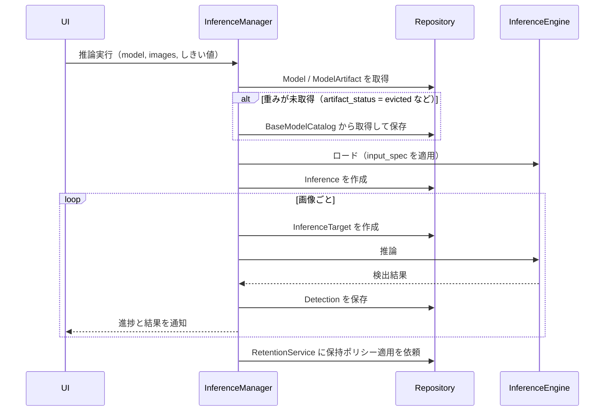
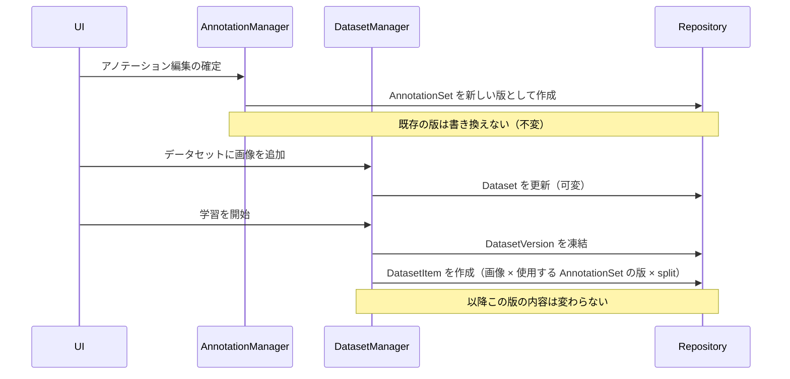
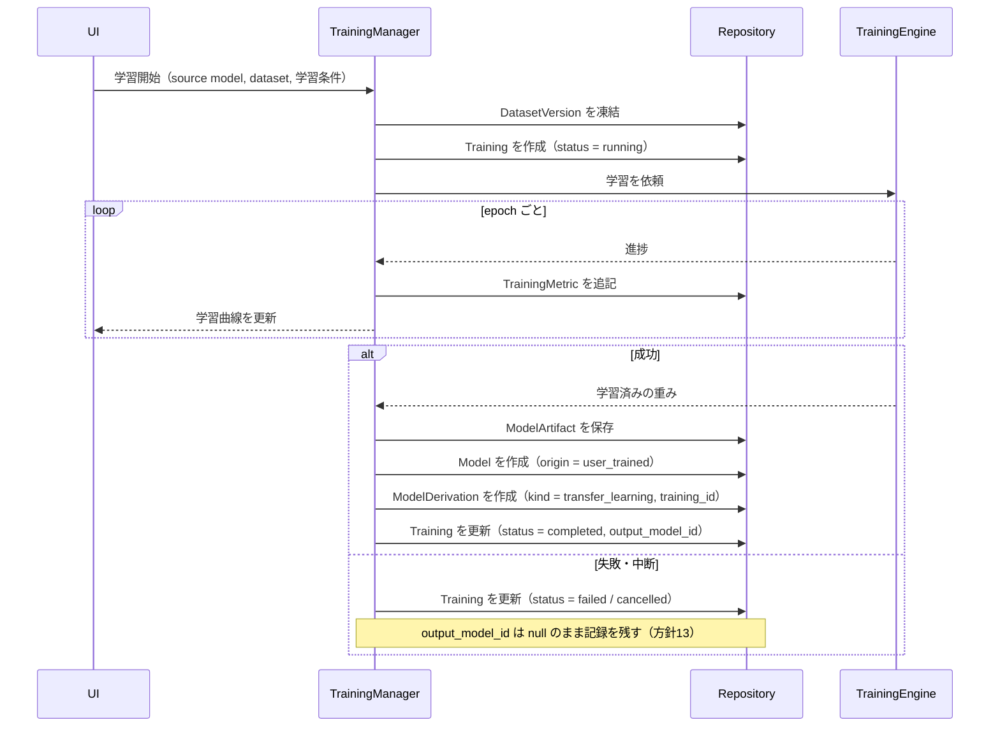
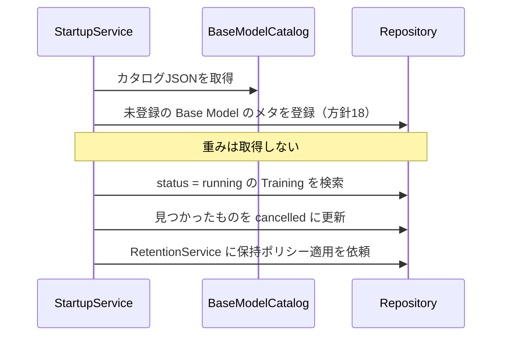

# システム構成・コンポーネント構成

| 項目 | 内容 |
| --- | --- |
| ステータス | 合意済（論点19〜24が決定済み、未決なし） |
| 対象 | `order.txt` §12「システム構成図」「ブラウザ内コンポーネント構成」 |
| 最終更新 | 2026-09-05 |
| 前提 | [01-conceptual-er-model.md](./01-conceptual-er-model.md)（確定済み） |
| 関連 | [02-open-decisions.md](./02-open-decisions.md) |

## 1. このドキュメントの位置づけ

確定した概念ERモデルを、ブラウザ内でどう配置し、どのコンポーネントが何を担うかに落とす。

ストレージの物理設計（IndexedDB / OPFS の使い分け、スキーマ、インデックス）は次フェーズ（04）で扱う。本ドキュメントでは、ストレージを抽象化する境界をどこに引くかまでを決める。

MLライブラリ・モデル形式・WebGPU / WASM の選定も引き続きスコープ外とする。ただし「どこで抽象化するか」は本ドキュメントで決める必要がある（`order.txt` §11 ⑥）。

## 2. 前提の整理 — 「サーバーを持たない」の定義

`order.txt` §2 は「システム構成を検討する際、サーバーを必須コンポーネントとして設計しない」としている。一方 §1 で「基本となる物体検知モデルは開発者側で作成・提供する」としており、Base Model の重み（数十MB）をユーザーに届ける経路が必要になる。

この2つは矛盾しないが、言葉の定義を揃えておかないと構成図が描けない。本設計では次のように定義する。

| 区分 | 本システムでの扱い |
| --- | --- |
| ステートフルなバックエンド（APIサーバー・DB） | **持たない。** ユーザーデータは一切サーバーに送信しない |
| 静的アセット配信（アプリ本体・Base Model の重み） | **前提とする。** 静的ホスティングまたはCDN。状態を持たず、認証も不要 |
| GPUサーバーでの学習 | 将来の拡張点。現時点では設計に含めないが、`TrainingEngine` の実装差し替えで対応できる構造にする |

つまり「サーバーを持たない」は **「ユーザーデータがブラウザの外に出ない」** という意味であり、静的ファイルの配信元まで否定するものではない。

## 3. 全体構成

```mermaid
flowchart TB
  subgraph static["静的配信（状態を持たない）"]
    APP["アプリ本体&#10;HTML / JS / WASM"]
    BASE["Base Model 配信&#10;メタ + 重み"]
  end

  subgraph browser["Browser（ユーザーデータはここから出ない）"]
    subgraph main["メインスレッド"]
      UI["UI Layer"]
      APPL["Application Layer"]
      DOMAIN["Domain Layer"]
    end
    subgraph worker["ML Worker（単一・ジョブキュー）"]
      MLR["ML Runtime&#10;推論 / 学習"]
    end
    STORE["Browser Storage"]
  end

  APP -->|初回ロード| UI
  BASE -->|メタ: 初回起動時&#10;重み: 使用時| APPL
  UI <--> APPL
  APPL --> DOMAIN
  APPL <-->|Port| MLR
  APPL <-->|Repository| STORE
  MLR -.->|重みの読み書き| STORE
```

Base Model のメタ情報は初回起動時に全件登録し、重みは使用時に取得する（[01 方針18](./01-conceptual-er-model.md#方針18-base-model-はメタを全件登録し重みは遅延取得する論点14)）。

## 4. レイヤ構成

`order.txt` §9 の4層（UI / Application / ML Runtime / Browser Storage）をベースに、確定したERモデルを踏まえて5層に整理する。

```mermaid
flowchart TB
  L1["UI Layer&#10;画面・ビュー・入力"]
  L2["Application Layer&#10;ユースケース（Manager / Service）"]
  L3["Domain Layer&#10;エンティティ・不変条件・系譜のルール"]
  L4["Port（抽象インターフェース）&#10;Repository / InferenceEngine / TrainingEngine"]
  L5["Infrastructure（Adapter）&#10;IndexedDB / OPFS / MLランタイム / fetch"]

  L1 --> L2
  L2 --> L3
  L2 --> L4
  L5 -.->|実装を注入| L4
```

### Domain Layer を追加する理由

`order.txt` §9 の原案には Domain 相当の層がない。確定したERモデルには、UIにもストレージにも属さないルールが複数ある。

- モデルは不変ノードであり、生成後に書き換えない（方針8）
- `DatasetVersion` は凍結後に内容を変更できない（方針2）
- `Model.project_id` は `origin = builtin` のときのみ null を許す（方針11）
- 系譜の親子関係は `ModelDerivation` にのみ持ち、`Model` 側には持たない（方針7）

これらを Manager や UI に散らすと、どこで守られているのか追えなくなる。ERモデルで決めた不変条件を1か所に集める層として Domain Layer を置く。

### 実行スレッド構成（論点19）

推論と学習を**単一の ML Worker に集約**し、Application Layer からはジョブキュー経由で依頼する。

```mermaid
flowchart LR
  APPL["Application Layer&#10;（メインスレッド）"]
  Q["ジョブキュー"]
  W["ML Worker"]
  APPL -->|"推論 / 学習ジョブ"| Q
  Q -->|"1件ずつ実行"| W
  W -.->|"postMessage で進捗・結果"| APPL
```

理由: ブラウザのメモリ上限が最大の制約であり、学習用と推論用でWorkerを分けると同じ重みを二重に持ちうる。学習中は推論が待たされるが、「学習中にも推論したい」という要求は、学習が長時間かかること自体がUX上の問題であり、並行実行で解くべきではない。

**複数タブでの同時学習は許さない。** 2つ目のタブでの学習開始はブロックする。排他の具体的な仕組み（Web Locks API など）は実装フェーズで選ぶ。この判断により、中断した `Training` の回収は起動時の一括処理で足りる（論点21）。

### Port を Application Layer の下に置く理由

`order.txt` §11 ⑥「アプリケーション層が特定のMLライブラリに直接依存しない構造」を、依存性逆転で実現する。

Application Layer は `InferenceEngine` / `TrainingEngine` / 各 Repository の **インターフェースにのみ依存**し、実装（ONNX Runtime Web、IndexedDB など）は起動時に注入する。これにより、MLランタイムやストレージ実装の差し替えが Application Layer に波及しない。

将来のGPUサーバー学習も、`TrainingEngine` の別実装として追加できる。

抽象化の粒度は、ユースケース単位に加えて**前処理と後処理を差し替え可能な単位として切り出す**（論点20）。前処理（リサイズ・正規化・letterbox）と後処理（デコード・NMS）はモデル形式ごとに差が大きく、ここを固定するとランタイムを替えたときにユースケース側の実装まで書き換えることになるため。

## 5. コンポーネント構成

### Application Layer

`order.txt` §9 の Manager 群を基に、確定したERモデルに合わせて追加・整理した。

| コンポーネント | 責務 | 主に扱うエンティティ |
| --- | --- | --- |
| `ProjectManager` | プロジェクトの作成・切替・削除 | `Project` |
| `ImageManager` | 画像の取り込み・重複排除・一覧 | `Image` `ImageBlob` |
| `LabelSetManager` | クラス体系の定義・派生 | `LabelSet` `LabelClass` |
| `AnnotationManager` | アノテーションの作成・版管理 | `AnnotationSet` `AnnotationObject` |
| `DatasetManager` | データセット編集・版の凍結・split 割当 | `Dataset` `DatasetVersion` `DatasetItem` |
| `ModelManager` | モデル一覧・メタ管理・重みの取得と破棄 | `Model` `ModelArtifact` |
| `ModelLineageService` | 系譜の探索・可視化用データの構築 | `ModelDerivation` |
| `TrainingManager` | 学習の開始・進捗管理・結果の確定 | `Training` `TrainingMetric` |
| `EvaluationManager` | 評価の実行とスコア記録 | `Evaluation` `EvaluationMetric` |
| `InferenceManager` | 推論の実行と結果記録 | `Inference` `InferenceTarget` `Detection` |
| `RetentionService` | 推論履歴の自動削除、参照されない実体の回収 | `Inference` `ImageBlob` `ModelArtifact` |
| `StorageQuotaService` | 容量の監視、逼迫時の通知と重みの破棄提案 | 横断 |
| `ExportService` / `ImportService` | プロジェクト一式・モデル単体の入出力 | 横断 |
| `StartupService` | Base Model カタログの同期、中断した `Training` の回収 | `Model` `Training` |

原案から追加したもののうち、次の4つは設計上の決定から必然的に生まれたコンポーネント。

- **`LabelSetManager`** — 方針1でクラス体系を独立エンティティにしたため、その管理主体が必要になった。
- **`RetentionService`** — 方針14（推論履歴の上限件数での自動削除）と方針16（実体のみ物理削除）を実行する主体。原案の構成図には保持ポリシーを担う場所がなかった。
- **`StorageQuotaService`** — 方針6で「容量が逼迫したら重みを破棄する」と決めたが、逼迫を検知する主体が必要。
- **`StartupService`** — 方針18（Base Model のメタを初回全件登録）と論点21（中断した `Training` の回収）は、どちらも起動時にしか実行できない処理。

### Port（抽象インターフェース）

| Port | 責務 | 想定される実装 |
| --- | --- | --- |
| `InferenceEngine` | モデルと画像を受け取り検出結果を返す | ブラウザ内MLランタイム |
| `TrainingEngine` | source model + dataset + 学習条件を受け取り、進捗を通知しつつ重みを返す | ブラウザ内MLランタイム／将来のGPUサーバー |
| `ModelLoader` | 重みのロード・アンロード・形式の解釈 | MLランタイム依存 |
| `Preprocessor` | `Model.input_spec` に従い画像をモデル入力に変換 | モデル形式ごとの実装 |
| `Postprocessor` | 生の出力を `Detection` に変換（デコード・NMS） | モデル形式ごとの実装 |
| `<Entity>Repository` | エンティティの永続化。ER図のエンティティ単位で用意 | IndexedDB / OPFS |
| `BlobStore` | 大容量バイナリ（画像・重み）の格納 | IndexedDB / OPFS |
| `BaseModelCatalog` | 配信元から Base Model のメタと重みを取得 | fetch |

`Repository` と `BlobStore` を分けるのは、方針6・16で「メタと実体を別の寿命で管理する」と決めたことに対応する。メタは件数が多く検索対象になり、実体は件数が少なく巨大という、要求特性の異なる2つを同じ抽象で扱わない。

`Preprocessor` / `Postprocessor` を独立させたのは論点20の決定による。前処理は `Model.input_spec`（方針15）を入力とするため、モデルのメタ情報だけで挙動が決まり、ユースケース側は差し替えを意識しない。

## 6. 主要ユースケースのデータフロー

### 6.1 推論の実行

前処理仕様は `Model.input_spec`、しきい値は `Inference` の属性から渡す（方針15）。

### 6.2 アノテーションからデータセット確定まで

### 6.3 転移学習

`Model` `ModelArtifact` `ModelDerivation` `Training` の4つを一貫した状態で書き込む必要がある。

途中でタブが閉じられた場合、`status = running` のまま `Training` が残る。この状態を書き換える処理自体が実行されないまま終わるため、**次回起動時に `StartupService` が `running` の `Training` を一括で `cancelled` にする**（論点21）。複数タブでの同時学習を許さない決定により、ハートビートによる生存確認は不要になっている。

### 6.4 起動時処理

## 7. 決定した論点

決定ログの通し番号を継続している（論点01〜18は概念ERモデルで決定済み）。選択肢と判断理由は [02-open-decisions.md](./02-open-decisions.md) を参照。

| # | 論点 | 決定 |
| --- | --- | --- |
| 19 | 実行スレッド構成 | 単一 ML Worker に集約。複数タブでの同時学習は許さない |
| 20 | ML Runtime の抽象化粒度 | ユースケース単位 + `Preprocessor` / `Postprocessor` を差し替え可能に |
| 21 | 進捗通知と中断 `Training` の回収 | postMessage で Application Layer に集約。起動時に `running` を一括 `cancelled` |
| 22 | Base Model の配信方式 | 同一オリジンの静的ファイル（カタログJSON + 重み） |
| 23 | 容量超過時の扱い | 事前監視 + 書き込み失敗時のリトライを併用 |
| 24 | オフライン動作 / PWA | アプリ本体のみキャッシュ。取得済みの重みでオフライン動作 |

### 実装フェーズへ持ち越す事項

| 事項 | 関連 |
| --- | --- |
| 複数タブでの学習開始をブロックする排他の仕組み（Web Locks API など） | 論点19 |
| `Preprocessor` / `Postprocessor` をモデル形式ごとにどう選択するか（`Model` に識別子を持たせるか、`ModelLoader` が判定するか） | 論点20 |
| 容量警告の閾値と、学習開始前の必要容量の見積もり方法 | 論点23 |
| Service Worker のキャッシュ戦略とアプリ更新時の扱い | 論点24 |

## 8. 次の作業

本ドキュメントの論点が確定した後、`order.txt` §12 に従いストレージ設計（04）へ進む。ストレージ設計では以下を扱う。

- `Repository` / `BlobStore` の物理実装（IndexedDB / OPFS の使い分け）
- エンティティごとのスキーマとインデックス設計
- 容量上限の見積もりと、方針14・16の削除ポリシーの具体化
