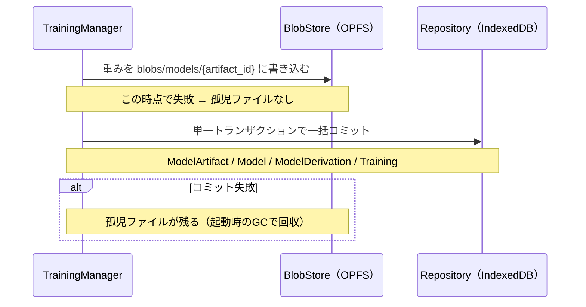

# ストレージ設計

| 項目 | 内容 |
| --- | --- |
| ステータス | 議論用たたき台（未決5件） |
| 対象 | `order.txt` §10「データ保存」、§12「ストレージ設計」 |
| 最終更新 | 2026-09-05 |
| 前提 | [01-conceptual-er-model.md](./01-conceptual-er-model.md) / [03-system-architecture.md](./03-system-architecture.md) |
| 関連 | [02-open-decisions.md](./02-open-decisions.md) |

## 1. このドキュメントの位置づけ

[03](./03-system-architecture.md) で定義した `Repository` / `BlobStore` の物理実装を決める。扱うのは以下。

- ブラウザストレージの選択と使い分け
- エンティティごとのオブジェクトストアとインデックス設計
- トランザクション境界と、整合性が崩れた場合の回復
- 容量の見積もりと、方針14・16の削除ポリシーの具体化

MLランタイム・モデル形式の選定は引き続きスコープ外とする。

## 2. 前提となる制約

### 2.1 「データを捨てない」を脅かす最大のリスク

`order.txt` §11 の設計思想③は「アプリケーション上で意味を持つデータは原則として管理対象とする」としている。しかしブラウザストレージには、アプリの実装とは無関係にデータが消える経路がある。

**ブラウザは、ディスク容量が逼迫したときにオリジンのデータをまとめて破棄することがある。** 既定の保存モードは best-effort であり、消去の対象になる。ユーザーが数十分かけて学習したモデルも、収集したアノテーションも、通知なく失われうる。

これは設計思想③と真っ向から衝突する。ストレージ実装を選ぶ前に、まずここへの対処を決める必要がある（論点26）。

対処の手段は Storage API の永続化要求（`navigator.storage.persist()`）で、許可されるとブラウザによる自動削除の対象から外れる。ただし許可の条件はブラウザごとに異なり、拒否されることもある。**拒否された状態をアプリがどう扱うか**を決めておかないと、「消えるかもしれない場所に、消えては困るデータを置き続ける」ことになる。

### 2.2 容量の上限

利用できる容量はブラウザ・OS・ディスク空き容量に依存し、確定値を前提にできない。実測では数百MB〜数GB程度の幅がある。

したがって本設計では、**特定の容量を前提とせず、使用量を実行時に問い合わせて振る舞いを変える**方針を取る（論点23の決定に対応）。

### 2.3 保存するデータの性質が2種類ある

| 種別 | 例 | 件数 | 1件のサイズ | 求められること |
| --- | --- | --- | --- | --- |
| メタデータ | `Image` `Detection` `Training` など | 多い（数千〜数万） | 小さい（〜数KB） | 検索・絞り込み・トランザクション |
| 実体 | `ImageBlob` `ModelArtifact` | 少ない（数十〜数千） | 大きい（数百KB〜数十MB） | 大容量の読み書き・部分読み出し |

この2つを同じ仕組みで扱うと、どちらかの要求を満たせない。[03](./03-system-architecture.md) で `Repository` と `BlobStore` を別の Port にしたのは、この違いに対応するため。

## 3. ストレージの選択

### 3.1 候補の比較

| | IndexedDB | OPFS（Origin Private File System） |
| --- | --- | --- |
| データモデル | オブジェクト + インデックス | ファイル + ディレクトリ |
| 検索 | インデックスによる範囲検索・複合キー | 不可（パスによる直接アクセスのみ） |
| トランザクション | 複数ストアにまたがる ACID | なし |
| 大容量の扱い | 実装依存。巨大な値は苦手 | 得意。ストリーミング・部分読み出し可 |
| 想定用途 | メタデータ | 実体（画像・モデル重み） |

### 3.2 方針

**メタデータは IndexedDB、実体は OPFS に置く**（論点25）。

```text
IndexedDB "browser-ai-framework"
├── projects / images / label_sets / label_classes
├── annotation_sets / annotation_objects
├── datasets / dataset_versions / dataset_items
├── models / model_artifacts / model_derivations
├── trainings / training_metrics
├── evaluations / evaluation_metrics
└── inferences / inference_targets / detections

OPFS
├── blobs/images/<blob_id>
└── blobs/models/<artifact_id>
```

`image_blobs` と `model_artifacts` は、**メタ（`byte_size` `checksum` など）を IndexedDB に、中身を OPFS に**置く。方針16で「メタは論理削除、実体は物理削除」と決めたことが、そのまま物理的な分離に対応する。

この分割には副作用がある。IndexedDB のトランザクションが OPFS への書き込みを含められないため、両方に書く操作は原子的にならない。対処は §6 で扱う。

## 4. オブジェクトストア設計

`keyPath` はすべて UUID / ULID（方針17）。インデックスは、実際に必要なクエリから逆算して定義する。

### 4.1 プロジェクトと画像

| ストア | keyPath | インデックス | 用途 |
| --- | --- | --- | --- |
| `projects` | `project_id` | `by_updated_at` | プロジェクト一覧 |
| `images` | `image_id` | `by_project`<br>`by_content_hash`<br>`[project_id, deleted_at]` | 一覧表示<br>重複排除（方針16）<br>削除済みを除いた一覧 |
| `image_blobs` | `blob_id` | `by_content_hash` | 同一内容の実体を共有する |

`Image` は論理削除（`deleted_at`）のため、一覧クエリは必ず削除済みを除外する。毎回のフィルタを避けるため複合インデックスを持たせる。

### 4.2 クラス体系とアノテーション

| ストア | keyPath | インデックス | 用途 |
| --- | --- | --- | --- |
| `label_sets` | `label_set_id` | `by_project` | 一覧 |
| `label_classes` | `label_class_id` | `by_label_set`<br>`[label_set_id, index]` | クラス一覧<br>モデル出力 index からの逆引き |
| `annotation_sets` | `annotation_set_id` | `[image_id, revision_no]`<br>`by_origin_target` | 画像の最新版取得・版一覧<br>推論由来の由来探索（方針12） |
| `annotation_objects` | `object_id` | `by_annotation_set`<br>`by_label_class` | 矩形の取得<br>クラス削除時の影響調査 |

`[image_id, revision_no]` は「その画像の最新版」を取るための索引。降順の先頭1件で取得できる。

### 4.3 データセット

| ストア | keyPath | インデックス | 用途 |
| --- | --- | --- | --- |
| `datasets` | `dataset_id` | `by_project` | 一覧 |
| `dataset_versions` | `dataset_version_id` | `[dataset_id, version_no]` | 版一覧・最新版 |
| `dataset_items` | `item_id` | `[dataset_version_id, split]`<br>`by_image`<br>`by_annotation_set` | 学習時の train / val / test 取り出し<br>画像の参照有無の判定<br>アノテーション版の参照有無の判定 |

`by_image` は削除可否の判定に使う。ある画像が `dataset_items` から参照されていれば、実体を物理削除してはいけない（§7）。

### 4.4 モデルと学習

| ストア | keyPath | インデックス | 用途 |
| --- | --- | --- | --- |
| `models` | `model_id` | `by_project`<br>`by_origin`<br>`by_label_set`<br>`by_artifact_status` | 一覧<br>Base Model の抽出（方針18）<br>互換モデルの絞り込み<br>重み破棄候補の抽出（方針6） |
| `model_artifacts` | `artifact_id` | `by_checksum` | 同一重みの共有・孤児検出 |
| `model_derivations` | `derivation_id` | `by_child_model`<br>`by_parent_model`<br>`by_training` | **親を辿る（系譜の遡上）**<br>子孫を辿る<br>学習との紐付け |
| `trainings` | `training_id` | `by_project`<br>`by_status`<br>`by_source_model`<br>`by_dataset_version` | 一覧<br>**起動時の中断回収（論点21）**<br>そのモデルからの派生履歴<br>そのデータで行った学習の比較 |
| `training_metrics` | `metric_id` | `[training_id, epoch]` | 学習曲線の再描画 |

`model_derivations.by_child_model` が系譜追跡の中心。`order.txt` §4 の「このモデルは、どのモデルから派生したのか」は、このインデックスを親方向に再帰的に辿ることで答える。

`Model.project_id` は Base Model のみ null を許す（方針11）。**IndexedDB のインデックスは値が `undefined` のレコードを索引に含めないため**、`by_project` で Base Model は引けない。Base Model は `by_origin` で別途取得し、プロジェクト内の一覧と結合する。

### 4.5 評価と推論

| ストア | keyPath | インデックス | 用途 |
| --- | --- | --- | --- |
| `evaluations` | `evaluation_id` | `by_model`<br>`by_dataset_version` | モデルの成績一覧<br>同一テストセットでのモデル比較 |
| `evaluation_metrics` | `metric_id` | `by_evaluation` | スコアの取得 |
| `inferences` | `inference_id` | `[project_id, executed_at]`<br>`[project_id, pinned, executed_at]`<br>`by_model` | 履歴一覧（新しい順）<br>**保持ポリシーの削除対象抽出（方針14）**<br>モデル別の履歴 |
| `inference_targets` | `target_id` | `by_inference`<br>`by_image` | 実行に含まれる画像<br>画像の参照有無の判定 |
| `detections` | `detection_id` | `by_target`<br>`by_label_class` | 検出結果の取得<br>クラス削除時の影響調査 |

`[project_id, pinned, executed_at]` は `RetentionService` が使う。pinned でないものを古い順に取り出して削除する。

**IndexedDB のインデックスは真偽値をキーにできない**ため、`pinned` は `0` / `1` の数値で保持する。ERモデル上は真偽値のままでよいが、永続化層で変換する。

## 5. 保存形式に関する補足

- `bbox` は `{x, y, w, h}` のオブジェクトで保持する。ピクセル座標か正規化座標かは `bbox_format` に持つ（方針5）。
- `hyperparameters` / `input_spec` / `label_mapping` は構造が変わりうるため、インデックスを張らない自由形式のオブジェクトとして保持する。検索対象にしない。
- `Detection` は1回の推論で数十件生まれる。`inference_targets` にまとめて埋め込む案もあるが、`by_label_class` での横断検索（「このクラスが検出された推論を探す」）ができなくなるため、独立ストアにする。

## 6. トランザクション境界

### 6.1 問題

転移学習の完了時に、次の4つを一貫した状態で書き込む必要がある（[03 §6.3](./03-system-architecture.md#63-転移学習)）。

- `ModelArtifact`（**OPFS**）
- `Model` / `ModelDerivation` / `Training`（**IndexedDB**）

IndexedDB のトランザクションは OPFS への書き込みを含められない。途中で失敗すると、次の2つの不整合が起こりうる。

| 状態 | 影響 |
| --- | --- |
| OPFS に重みがあるが IndexedDB にメタがない | 孤児ファイル。容量を占有し続ける |
| IndexedDB にメタがあるが OPFS に重みがない | `artifact_status = present` なのに実行できないモデル |

### 6.2 方針

**実体を先に書き、メタを後からトランザクションでコミットする**（論点27）。



この順序なら、後者の不整合（メタはあるが実体がない）は発生しない。前者の孤児ファイルは容量を占有するだけで、参照されないため機能には影響しない。

**孤児ファイルは起動時に回収する。** `StartupService` が OPFS のファイル一覧と IndexedDB の `model_artifacts` / `image_blobs` を突き合わせ、対応するメタのないファイルを削除する。OPFS のファイル名を ID そのものにしているのは、この突き合わせを可能にするため。

### 6.3 IndexedDB 側の書き込み単位

同一トランザクションでまとめる必要がある組み合わせ。

| 操作 | 同一トランザクションに含めるストア |
| --- | --- |
| 学習の完了 | `model_artifacts` `models` `model_derivations` `trainings` |
| アノテーションの版確定 | `annotation_sets` `annotation_objects` |
| データセット版の凍結 | `dataset_versions` `dataset_items` |
| 推論の記録 | `inferences` `inference_targets` `detections` |

推論は画像枚数 × 検出件数のレコードが生まれるため、1回の実行を1トランザクションにすると長時間ロックする。画像ごとに分割し、`InferenceTarget` 単位でコミットする（`InferenceTarget.status` が中途半端な状態を表現できる — 方針9）。

## 7. 削除と参照整合性

方針16の「メタは論理削除、実体のみ物理削除」を、具体的な判定手順に落とす。

### 7.1 実体を削除してよい条件

| 実体 | 削除可能な条件 | 判定に使うインデックス |
| --- | --- | --- |
| `ImageBlob` | 同じ `content_hash` を参照する `Image` がすべて論理削除済み、かつどの `dataset_items` / `inference_targets` からも参照されていない | `images.by_content_hash`<br>`dataset_items.by_image`<br>`inference_targets.by_image` |
| `ModelArtifact` | 対応する `Model` が論理削除済み、または ユーザーが明示的に重みを破棄した | `models.by_artifact_status` |

`ModelArtifact` は `Model` が生きていても破棄できる（方針6）。破棄後は `artifact_status = evicted` となり、系譜上のノードとしては残る。

### 7.2 参照カウントをどう持つか

上記の判定は、参照元を毎回集計する方式と、参照カウントを保持する方式のどちらでも実現できる（論点29）。

### 7.3 削除の実行タイミング

| 契機 | 実行者 | 内容 |
| --- | --- | --- |
| 起動時 | `StartupService` | 孤児ファイルのGC、中断 `Training` の回収 |
| 推論の完了後 | `RetentionService` | 上限件数を超えた `Inference` の削除（方針14） |
| 容量の閾値超過時 | `StorageQuotaService` | ユーザーへの警告、破棄候補（`artifact_status = present` の中間モデル）の提示 |
| 書き込み失敗時 | `StorageQuotaService` | 解放を試みてリトライ（論点23） |

## 8. 容量の見積もり

上限件数や警告閾値を決める根拠として、概算を置く。実測ではなく設計時の見積もりであり、実装フェーズで検証する。

| データ | 1件あたり | 想定件数 | 小計 |
| --- | --- | --- | --- |
| 画像の実体 | 500KB | 1,000枚 | 約 500MB |
| 画像のメタ | 0.3KB | 1,000件 | 約 0.3MB |
| アノテーション | 2KB（矩形10件想定） | 1,000件 × 3版 | 約 6MB |
| モデルの重み | 20MB | 10世代 | 約 200MB |
| 学習ログ | 0.2KB | 30 epoch × 20回 | 約 0.1MB |
| 推論履歴 | 2KB（検出20件想定） | 1,000回 | 約 2MB |

**支配的なのは画像の実体とモデルの重みで、合計の 99% 以上を占める。** メタデータ側は件数が増えても容量にはほとんど影響しない。

この比率から次が言える。

- 容量が逼迫したときに解放すべきは、まず**中間世代のモデル重み**（1件20MBで、系譜を残したまま破棄できる）。
- 推論履歴の上限件数は、容量よりも**一覧の見やすさ**の観点で決めてよい。1,000件で2MB程度であり、容量制約にはならない。
- 画像は削除するとデータセットが壊れるため、最後の手段。

## 9. 設計上の論点

決定ログの通し番号を継続する。詳細と選択肢は [02-open-decisions.md](./02-open-decisions.md) を参照。

| # | 論点 | 優先度 |
| --- | --- | --- |
| 25 | 実体（画像・重み）の格納先 | 高 |
| 26 | 永続化要求（`persist()`）の扱いと、拒否された場合の方針 | 高 |
| 27 | IndexedDB / OPFS 間の不整合の回復方式 | 中 |
| 28 | スキーマ変更（マイグレーション）の方針 | 中 |
| 29 | 参照カウントの管理方式 | 低 |

## 10. 次の作業

本ドキュメントの論点が確定すると、`order.txt` §12 が挙げた設計項目（ER図 → システム構成図 → コンポーネント構成 → ストレージ設計）はすべて完了する。

その後は実装フェーズの計画に移る。各設計ドキュメントの「実装フェーズへ持ち越す事項」を集約し、MLランタイム・モデル形式の技術選定と合わせて優先順位をつける。
